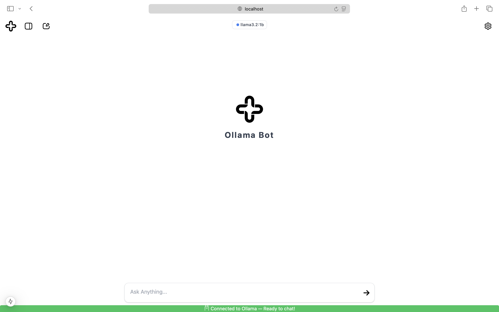
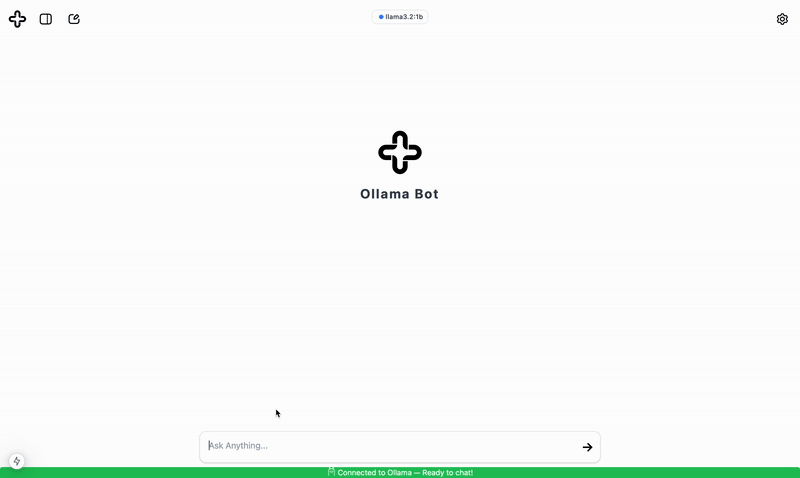
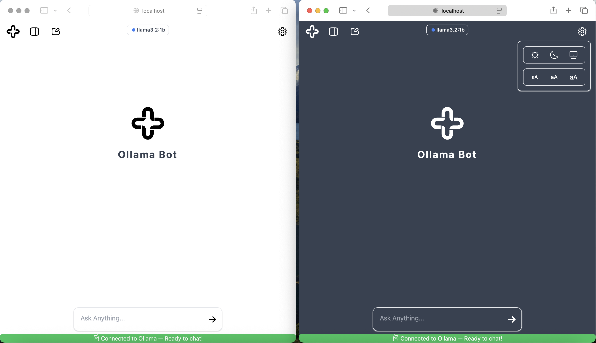
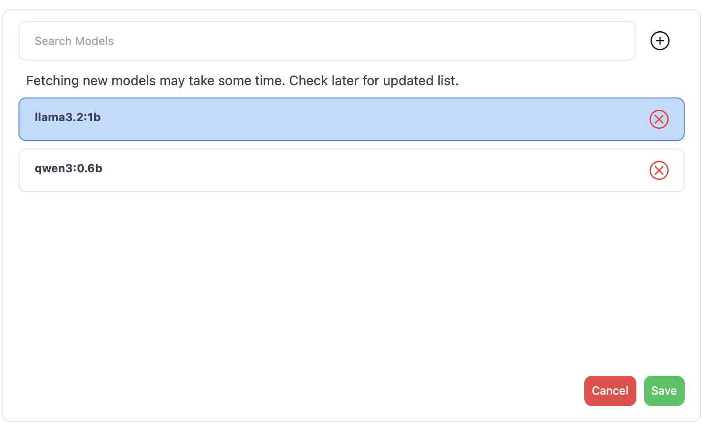
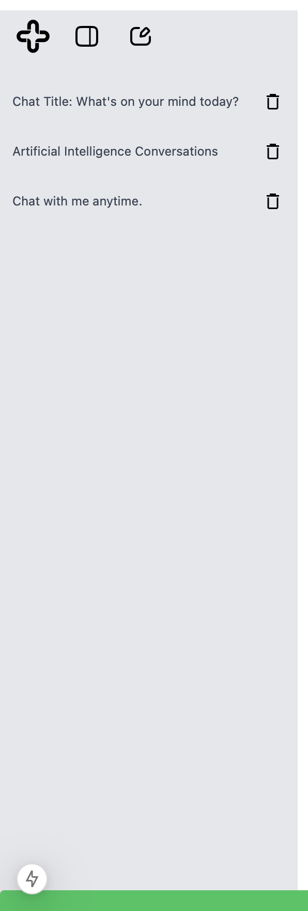
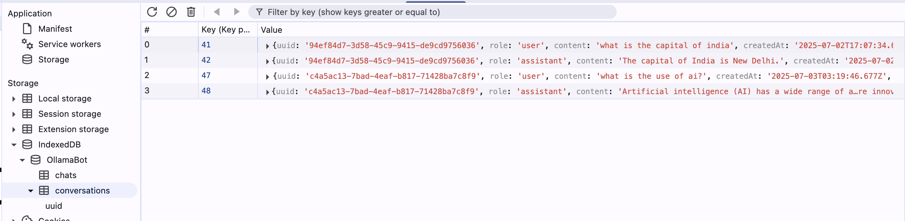
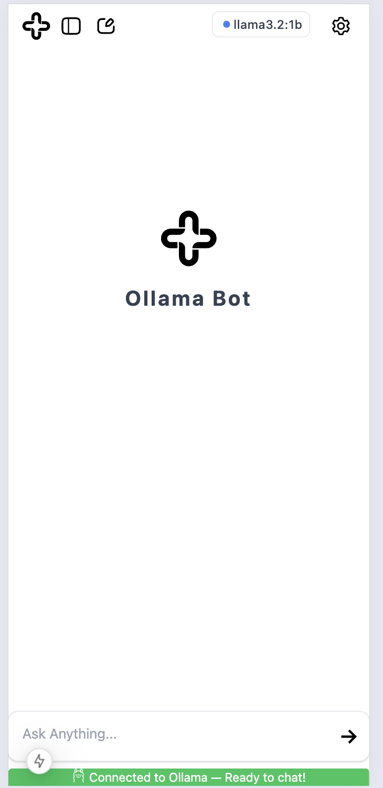
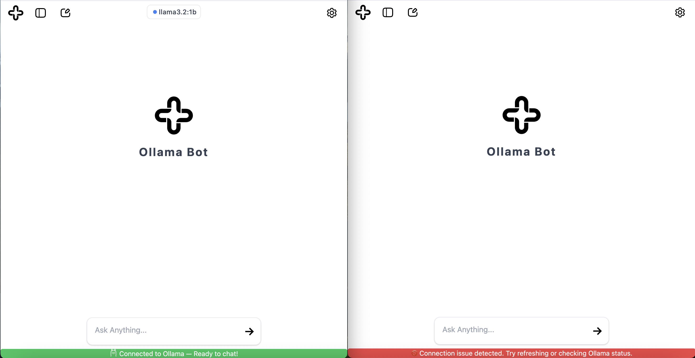

# Ollama Bot [Website](https://ollamabot.netlify.app/)

This is a simple chat application that allows users to interact with an AI model using Ollama. The application is built with React and TypeScript using Next.js, and it includes features like chat history, message submission, and theme switching.

## Image of the Home Page.



## Prerequisites

- Node.js and npm are required to run this project. You can download and install them from [Node.js official website](https://nodejs.org/).

- Ollama is required to run this project as it serves as the backend. You can download and install it from [Ollama official website](https://ollama.com/download).

## Inspiration

This project was inspired by an chrome extenstion call , that allows users to interact with AI models in web applications using Ollama as a backend.

## Run this project locally

1. Clone the repository:

   ```bash
   git clone
   ```

2. Change to the project directory:
   ```
    cd ollama_bot
   ```
3. Install dependencies:

   ```bash
   npm install
   ```

4. Start the development server:
   ```bash
   npm run dev
   ```

## Features:

- **Chat Interface**: Users can send messages to the AI model and receive responses.

### Exmple image of a chat interface:



- **Theme Switching**: Users can switch between light and dark themes for better readability.

### Example image of theme switching:



- **Model Selection**: Users can select different AI models to interact with. Can manage models using the ui whether to add or remove a model, on click of the model button display at the top of the chat interface, the model will be selected and the chat will be updated with the new model. Double click on the delete icon to delete the model.

### Example image of model selection:



- **Chat History**: The application maintains a history of the chat, allowing users to scroll through previous messages. Double click on the delete icon to delete the chat history.

### Example image of a chat history:



- **Persistent Storage**: The application uses IndexedDB to save chat history and user preferences, ensuring that data is retained across sessions. The code is available in the `src/app/Utils/db.ts` file.

### Example image of persistent storage:



- **Responsive Design**: The application is designed to be responsive, ensuring a good user experience on both desktop and mobile devices.

### Example image of responsive design:



- **Status Indicator**: The application includes a status indicator that shows whether the AI model(Ollama) is online or offline or if there was any error in the system. This helps users know if they can interact with the model.



## Resources used:

- [Ollama Documentation](https://ollama.com/docs) - Official documentation for Ollama.
- [Ollama CORS and Port Binding](https://objectgraph.com/blog/ollama-cors/) - A guide on how to handle CORS issues with Ollama.
- [Netlify](https://www.netlify.com/) - Used to deploy the application.
- [Design.com](https://www.design.com/) - Used to create the logo for the application.
- [Figma](https://www.figma.com/) - Used to customize the logo for the application.
- [Postman](https://www.postman.com/) - Used to test the Ollama API endpoints.
- [CloudConvert](https://cloudconvert.com/) - Used to convert the SVG logo to ICO format.
- [SVG Repo](https://www.svgrepo.com/) - Used for svg icons in the application.
- [EZGIF](https://ezgif.com/maker) - Used to create the GIFs for the README file.
- [Canva](https://www.canva.com/) - Used to create the image (old logo) for this project.
- LLM's and Internet in general in case of any issues found during the development of this project.

## Next Steps

Create a extension for the Ollama Bot that allows users to interact with the AI model in web applications. The extension should be able to send messages to the AI model and receive responses, allowing users to have conversations with the AI model in real-time. Also, optimise the code for better performance and user experience.
